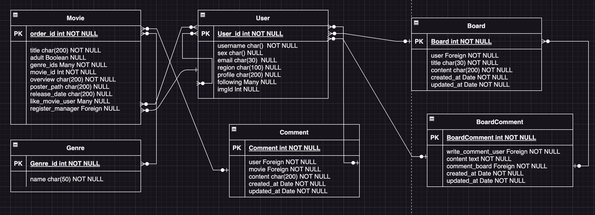

# Final_Pjt

## 1. 팀원 정보 및 업무 분담 내역
  - 공통업무
    1. 프로젝트 기획 
    2. DB관리 
    3. ERD 설계
    4. 프로젝트 레이아웃 초안 작성
    5. 홈페이지 디자인(css)

  - 김태형 주요 업무
    1. 백앤드 구현
    2. 영화 추천 게임 구현
    3. 좋아요, 팔로우, 유저 기능 구현
    4. 영화 장르 데이터처리

  - 김승현 주요 업무
    1. API 사용 처리 (youtube API, TMDB API)
    2. 동영상 편집 및 이미지 편집
    3. 영화 추천 알고리즘 구현 
    4. UI/UX 
    
---

## 2. 목표 서비스 구현 및 실제 구현 정도
  - 목표 서비스
    1. 홈페이지 기본 기능 구현(o)
    2. 검색을 통한 영화찾기 기능 구현(o)
    3. 장르에 따른 영화목록 구성(o)
    4. 자유게시판, 댓글 및 커뮤니티 기능(o)
    5. YOUTUBE API 요청을 통한 동영상 렌더링(o)
    6. 유저 프로필, 이미지 추가(o)
    7. 유저 간의 팔로우, 유저의 영화 좋아요 기능(o)
    8. 유저의 영화 별점 기능(x)
    9. 구글 로그인, 카카오 맵 기능(x)
    10. 대댓글 기능(x)

---

## 3. 데이터베이스 모델링(ERD)

---

## 4. 영화 추천 알고리즘에 대한 기술적 설명
  1. 영화 장르 선택 기능
   
  - movie 와 genres 모델간의 many to many fields를 설정
  - genres의 key, value값 데이터를 처리하여 원하는 장르를 고를 수 있게함
  - genre에 맞는 리스트들을 저장하여 웹에서 버튼을 통해 화면에 보여주도록 설정

  2. 영화 월드컵게임
   
  - 게임을 통해 영화의 포스터만으로 유저가 장르를 세분화 할 수 있도록 설정
  - 전체 movie 리스트에서 랜덤으로 뽑아내어 두 개씩 정보를 보여주면서 토너먼트 식으로 하나의 작품이 나올 수 있도록 구성
  - 마지막으로 하나의 영화의 장르의 데이터를 추출하여 해당 장르의 영화중 4개의 작품을 랜덤으로 뽑아 추천

---

## 5. 서비스 대표 기능에 대한 설명
  1. 검색 기능
  - 제목과 내용에서의 검색한 내용이 포함되면 해당하는 영화 리스트를 가시적으로 보여줌
  2. 유저간 팔로우 기능
  - 유저의 팔로우를 통해 유저간 팔로워, 팔로잉 숫자를 나타냄
  3. 영화 좋아요 기능
  - 각 유저의 영화 좋아요를 누름으로써 프로필에서 유저가 좋아요를 누른 영화의 리스트들을 평점 높은 순으로 추출
  4. 자유 게시판, 영화 디테일 에서의 댓글 기능
  - 커뮤니티 활성화를 통해 유저 간 소통가능
  5. YOUTUBE 동영상
  - 디테일에서 영화의 제목, 내용, 평점으로는 어떤 영화인지 판별이 불가하다고 생각해 예고편 동영상을 통해 영화에 대한 이해도를 높임
  6. 로그인, 회원가입, 회원탈퇴
  - 회원가입을 통한 유저의 로그인의 유무에 따라 커뮤니티 기능 사용 유무 판별
---
## 6. 느낀점
- 김태형  
이번 프로젝트로 인해 가장 많이 배운점은 git 활용하는 방법이었다.
가장 오류도 많았고 시행착오도 있었다. branch와 merge를 이용해서 프로젝트를 공유하면 오류가 많이 뜨지 않을 것이라 기대했지만 병합하는 과정에서 다른 branch에서 편집한 것들이 겹치거나 지워지는 파일등에서 많은 오류가 발생하였다.
이 오류가 발생하는 상황을 git 병합처리 중에 처리하거나 지워지는 파일이 겹치면 처리 후 다시 재시작 하는 식의 방식을 배웠다.
git 이외에도 백앤드의 전반적인 처리 과정등이나 데이터 베이스의 구조 백앤드와 서버의 통신 방법등에 대해서 고민하고 해결하는 과정을 통해서 많이 성장 할 수 있어서 매우 좋은 경험이라고 생각한다. 마지막으로 협업의 중요성을 배웠다. 근10일 이라는 시간동한 팀원과 소통하고 서로 부족한 부분을 채워주면서 함께 앞으로 나아가고 있다는 경험은 이번 프로젝트를 통해서 가장 큰 자산이라고 생각한다. 이번 경험을 통해서 남은 싸피 생활뿐 아니라 나중에도 내가 협업하는 상황에서 힘을 받을 수 있을 것 같다. 재미있었고 즐겁게 마무리 해서 좋았습니다.  

- 김승현  
Fianl_pjt를 진행하면서 크게 느꼇던 점은 팀원과의 잦은 소통의 필요성였습니다. 프로젝트 초기 부분 팀원과 이야기를 잘 나누었다고 생각이 들었지만 제가 라이브러리 설치 미흡으로 인해 다른 작업을 했던 팀원은 2, 3 시간 정도 고생을 했던 기억이 납니다. 그 이후로는 서로의 자세한 일정 및 데이터 처리, 기능 작업을 할 때 마다 대화를 나누었고 그 결과로 프로젝트를 성공리에 잘 마친 것 같습니다. 성공한 기능도 많지만 구현하고 싶은 기능도 많기에 프로젝트를 마치면서 기쁨보다 아쉬움이 먼저 다가온 것 같습니다.  고생해준 저의 팀원인 태형이형께 너무 고마운 마음을 가지면서 저의 첫 싸피 장기프로젝트를 마칩니다.